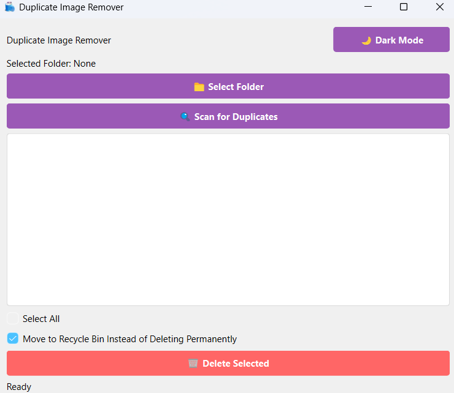

# Duplicate-Image-Remover
A tool to find and delete any duplicate images, even if the image is slightly edited or even if the compression size is different, this application will help you delete them.

# Duplicate Image Remover 🔍🗑️


A lightweight GUI tool to find and remove duplicate images using content-based hashing.



## Features ✨
- 🖼️ Content-based duplicate detection (not just filename matching)
- 🗂️ Recursive folder scanning
- 🎨 Dark/Light mode toggle
- ♻️ Safe Recycle Bin deletion (optional permanent delete)
- 📊 Progress tracking during scans

## Usage 🚀
-Launch DuplicateImageRemover.exe

-Click Select Folder to choose an image directory

-Click Scan for Duplicates

-Select files to remove (checkboxes)

-Choose deletion method:

  -🗑️ Recycle Bin (default)
  
  -⚠️ Permanent deletion
  
-Click Delete Selected

## Requirements ✔️
-Windows 10/11 (64-bit recommended)

-Python 3.10+ (for source version)

## Building from Source 🔨
-"pyinstaller --onedir --windowed --icon=app_icon.ico gui.py"

## Contributing 🤝

-Pull requests welcome! Please:

-Fork the repository

-Create a feature branch

-Submit a PR with clear documentation


## License 📜
MIT License - See LICENSE.txt for details.

💻 Developer: RSWaqar

📧 Contact: rashedwaqarzafr@gmail.com

🔗 Project Link: https://github.com/RSWaqar/Duplicate-Image-Remover

## Installation 📦
### For End Users
Download the latest installer from [Releases](https://github.com/RSWaqar/Duplicate-Image-Remover/releases).

### For Developers
```bash
git clone https://github.com/RSWaqar/Duplicate-Image-Remover.git
cd Duplicate-Image-Remover
pip install -r requirements.txt
